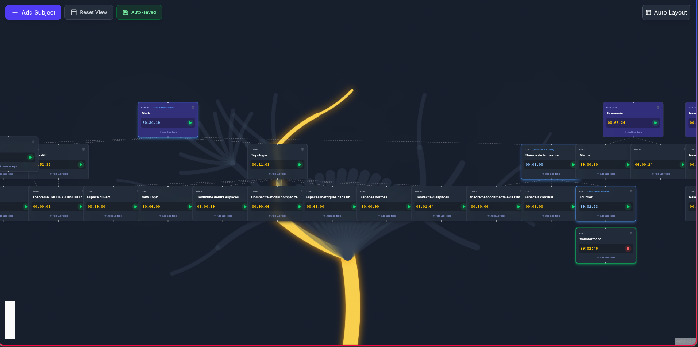

# Project Context: SessTracker (Revision Tracker)

## Overview
SessTracker is a web application designed to track revision sessions using a visual, tree-based interface. It helps users organize subjects and topics hierarchically and track time spent on each.



## Technology Stack
- **Framework**: React 19 + TypeScript 5.9 + Vite 7
- **Styling**: TailwindCSS v4 + Framer Motion (animations)
- **Visualization**: React Flow (@xyflow/react) for the node tree
- **State Management**: Zustand (with persistence middleware)
- **Icons**: Lucide React
- **Layout Engine**: Dagre (for auto-layout)


## Project Structure
/src
  /components
    /features
      /background
        BackgroundTree.tsx       # Canvas component for the Organic 3D Background
        RootsBackground.tsx      # Inverted organic tree for Roots view
        GeometricForestBackground.tsx  # 2D flat trees for calendar (React.memo)
        ForestUndergrowth.tsx    # Ground/bushes/flowers canvas for calendar (React.memo)
      /calendar                  # Calendar/Schedule view
        CalendarView.tsx         # Weekly schedule view
        SessionModal.tsx         # Add/Edit session modal
      /controls
        FloatingControls.tsx     # Top-left controls
      /sky                       # Starry Sky view (objectives)
        SkyView.tsx              # Sky screen: click-to-place star objectives, action menu
        SkyBackground.tsx        # Canvas: aurora borealis + ambient stars + layered clouds
        ShootingStars.tsx        # CSS-animated shooting stars (React.memo)
        StarIcon.tsx             # SVG star shapes: classic, four-point, eight-point, sparkle
      /stats                     # Statistics and Roots view
        RootsView.tsx            # Bottom section container
        StatisticsPanel.tsx      # Charts and data visualization (lazy-loaded)
      /todo
        TodoListPanel.tsx        # General objectives list with add/toggle/delete
      /tree                      # Main Tree view
        MainTree.tsx             # Middle section container
    /nodes
      RevisionNode.tsx           # Custom Node component with Timer & Controls
    /ui
      WindowFrame.tsx            # Draggable + resizable window (framer-motion)
      ShortcutsOverlay.tsx       # Keyboard shortcuts modal overlay
  /hooks
    useAutoLayout.ts             # Hook using Dagre to organize the tree
    useCanvas.ts                 # Shared DPR-aware Canvas2D hook (resize + draw)
    useTreeCanvas.ts             # Specialized Canvas2D hook for fractal tree drawing
  /store
    /slices                      # Modular store logic (slices)
      nodeSlice.ts
      timerSlice.ts
      historySlice.ts
      todoSlice.ts
      calendarSlice.ts           # Calendar session management
      starSlice.ts               # Sky star objectives management
      uiSlice.ts                 # Window management + scroll navigation
      types.ts
    /__tests__                   # Slice unit tests (7 files)
    useRevisionStore.ts          # Main Zustand store combining 7 slices
  /types
    index.ts                     # Shared TypeScript interfaces
  /utils
    /__tests__                   # Unit tests
      graphHelpers.test.ts
    graphHelpers.ts              # Graph traversal utilities
    canvasGeometricUtils.ts      # pseudoRandom (deterministic hash), draw2DFlatTree, draw2DHorizon
  App.tsx                        # Main entry point
  main.tsx                       # React root
  index.css                      # Global styles + shooting-star keyframes

## Key Features
1.  **Visual Revision Tree**:
    -   Subjects and topics are nodes in a graph.
    -   Users can add root "Subjects" and child "Topics".
    -   **Recursive Deletion**: Deleting a node removes all its descendants.
    -   **Renaming**: Click on a node label to rename it (persisted on blur/enter).

2.  **Time Tracking**:
    -   Each node has an independent stopwatch.
    -   Only one timer can be active at a time (switching nodes pauses the previous one).
    -   Time determines the "Score" or progress (currently just displayed as HH:MM:SS).

3.  **Persistence**:
    -   State is automatically saved to `localStorage` via Zustand middleware.
    -   "Auto-saved" indicator provides visual feedback.

4.  **Auto-Layout**:
    -   "Auto Layout" button uses the Dagre algorithm to organize nodes in a top-down tree structure.

5.  **Motivational UI**:
    -   Dark mode with glassmorphism effects.
    -   Animated glows when timers are active.

## Setup & Commands
- **Install**: `npm install`
- **Run**: `npm run dev` (Forces port 5173 defined in `vite.config.ts`)
- **Test**: `npm test` (Runs Vitest unit tests)
- **Build**: `npm run build`

## New Features (v1.1)

### Recursive Time Tracking & Visuals
-   **Accumulation**: Time spent on a child node recursively updates all its ancestors.
-   **Optimization**: Ancestor path is calculated once when timer starts (stored in `activeAncestorIds`).
-   **Visual Feedback**:
    -   Active Node: Green border/glow.
    -   Ancestors: Blue border/glow + "(Accumulating)" badge.

### Background Fractal Tree (v1.2)
-   **Technology**: HTML5 Canvas + Recursive Function.
-   **Design**: "Organic 3D" style using:
    -   **Bezier Curves**: For natural, non-linear branches.
    -   **Variable Widths**: Tapering branches to simulate depth.
    -   **Gradient/Shadows**: Gold glow for active paths, Slate silhouette for inactive.
-   **Stability**: Replaced `Math.random()` with a **deterministic hash function** based on node IDs. This ensures the tree looks organic but remains pixel-perfectly static across re-renders (fixing the "jitter" issue).
-   **Logic**:
    -   A "Virtual Root" draws a main trunk from the bottom.
    -   It branches out to the user's "Root Subjects".
    -   Then recursively follows the React Flow edges (`activeAncestorIds` determines the glow).

## Known Implementation Details
- **Port**: Configured to strictly use port `5173` to prevent data "loss" (since localStorage is origin-bound).
- **Auto-Save**: The "Auto-saved" badge is purely visual feedback; saving happens synchronously on every state change.
- **Roots Background Opacity**: Implemented using **local component state** (`useState`) in `RootsView.tsx` with a vertical slider.
- **Scroll Management**: Store-driven via `scrollToArea()` action in `UiSlice`, handled centrally in `App.tsx`.
- **Initial Scroll**: App mounts scrolled to the tree view (middle); the sky view is discovered by scrolling up.

## Architecture Deep Dive

### 1. Store Structure (Zustand)
The application state is centralized in `useRevisionStore` which combines multiple slices:
-   **`nodeSlice`**: Manages the graph structure (Nodes & Edges). Handles recursive deletion and label updates.
-   **`timerSlice`**: Handles the stopwatch logic.
    -   **`tickCallback`**: The heartbeat of the app. Updates `totalTime` for the active node and all its ancestors (recursive accumulation).
    -   **`activeAncestorIds`**: Cached list of ancestors for the currently running node to optimize rendering (O(1) lookup during renders).
-   **`historySlice`**: Implements Undo/Redo logic by snapshotting `nodes` and `edges` states.
-   **`uiSlice`**: Manages the Window Manager state (position, size, z-index, minimization, snapping) for floating windows.
-   **`calendarSlice`**: Manages dynamic, date-based weekly schedule sessions (`CalendarSession`).
-   **`starSlice`**: Manages spatial objectives as stars in the Sky View. Data: `id`, `text`, `x`, `y` (normalized 0–1 percentages), `modelType` (classic/four-point/eight-point/sparkle), `createdAt`. Uses `uuid` for IDs.
-   **`todoSlice`**: Simple valid/invalid state for the "General Objectives" list.

### 2. Rendering & Layout
-   **Main Tree**: Uses `React Flow` for the node graph.
    -   **Auto-Layout**: `dagre` algorithm calculates node positions hierarchically.
    -   **Nodes (`RevisionNode.tsx`)**: framer-motion components with local state for performant input handling. Visual feedback (Green border = Running, Blue border = Accumulating).
-   **Starry Sky View**:
    -   Located above the main tree (first screen). Canvas background (`SkyBackground.tsx`) renders aurora borealis, ambient stars, and layered clouds via `useCanvas` hook.
    -   `ShootingStars.tsx`: 20 CSS-animated meteors with `pseudoRandom` deterministic positions.
    -   `SkyView.tsx`: Click-to-place star objectives with inline input, hover tooltips, and selection menu (rename, change shape, delete).
    -   Star positions stored as normalized percentages (0–1) for responsive layout.
-   **Backgrounds**:
    -   **`BackgroundTree`**: A recursive fractal tree drawn on HTML5 Canvas. Deterministic generation based on node IDs ensures stability across renders.
    -   **`RootsBackground`**: An inverted variant allowing opacity control for the "Roots" view.
    -   **`GeometricForestBackground`**: Used in Calendar view, simpler geometric abstraction.

### 3. Window System ("Hyprland-like")
-   **`WindowFrame.tsx`**: A wrapper component providing:
    -   Draggable header (framer-motion).
    -   Resizable edges.
    -   Opacity control (slider in header).
    -   **Snapping**: `Ctrl+Shift+Arrow` or dragging to edges (logic in `uiSlice`).
-   **Z-Index Management**: Clicking a window brings it to the front (`focusWindow`).

### 4. Navigation & Views
The app uses a spatial navigation model:
-   **Vertical Scroll** (snap-y):
    -   **Top**: Starry Sky View (`SkyView.tsx`) — spatial objectives.
    -   **Middle**: Main Tree (`MainTree.tsx`) — default view on mount.
    -   **Bottom**: Roots/Stats View (`RootsView.tsx`).
-   **Horizontal Scroll** (snap-x, from Main Tree):
    -   **Right**: Calendar (`CalendarView.tsx`).
-   **Navigation Helpers**:
    -   Store-driven via `scrollToArea('sky' | 'tree' | 'roots' | 'calendar' | 'treeHorizontal')` — `App.tsx` listens and scrolls smoothly.

## Feature Reference

### Starry Sky View
-   **Path**: `src/components/features/sky/`
-   **Components**: `SkyView`, `SkyBackground` (canvas: aurora + stars + clouds), `ShootingStars` (CSS animations), `StarIcon` (4 SVG shapes).
-   **Features**: Click-to-place star objectives, hover tooltips, selection menu (rename, change shape, delete), responsive positions.
-   **Data**: Stored as normalized percentages (0–1) via `starSlice`. Persisted in localStorage. Legacy pixel values (>1) supported via fallback.

### Calendar (Forest Scheduler)
-   **Path**: `src/components/features/calendar/`
-   **Features**: Dynamic date-based weekly view, navigation between weeks, Add/Edit sessions, Color coding, 24-hour time grid.
-   **Data**: Sessions are tied to specific dates (YYYY-MM-DD) and persisted in the `calendarSessions` array via `calendarSlice`.

### Statistics (Roots)
-   **Path**: `src/components/features/stats/`
-   **Visualization**: `Recharts` AreaChart showing cumulative time over sessions for the selected node.

### Keyboard Shortcuts
-   **Undo**: `Ctrl+Z`
-   **Redo**: `Ctrl+Y` or `Ctrl+Shift+Z`
-   **Window Snapping**: `Ctrl+Shift+ArrowKeys` (when a window is focused)
-   **Documentation**: Pressed via "Keyboard" icon in Roots view or defined in `src/data/shortcuts.ts`.

## Git Workflow (Reminder)

```bash
# 1. Add modified files
git add .

# 2. Commit
git commit -m "Your message"

# 3. Push
git push
```
