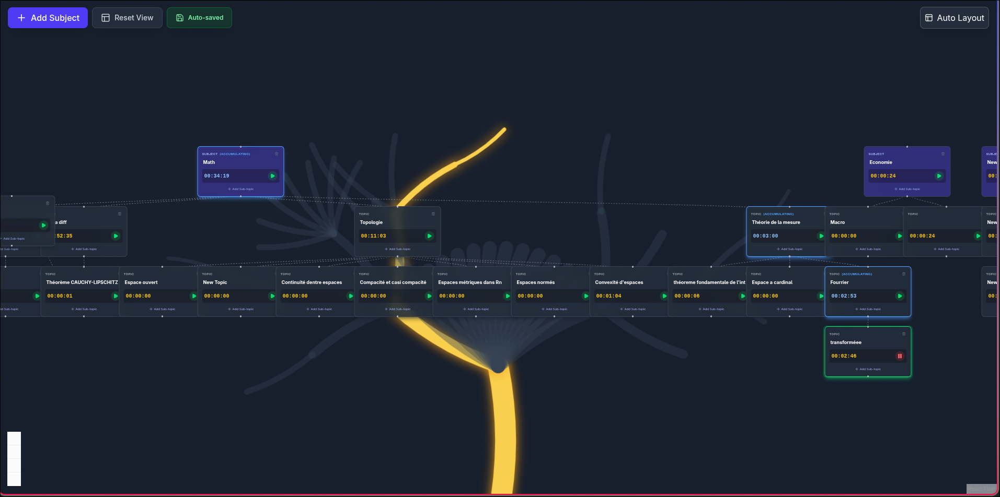

# SessTracker

A visual, tree-based revision tracking application. Organize your subjects, break them down into topics, and track your study time with a hierarchical timer system.



## Demo


## Features

### Visual Revision Tree

- **Hierarchical organization** -- Create root subjects and child topics, with infinite nesting.
- **Auto-layout** -- Organize the tree automatically using the Dagre algorithm.
- **Recursive deletion** -- Deleting a node removes all its descendants.
- **Inline renaming** -- Click on a node label to rename it.

### Smart Time Tracking

- **Individual timers** -- Each node has its own stopwatch.
- **Recursive accumulation** -- Time spent on a child topic automatically adds up to all its parents.
- **Visual feedback** -- Active node glows green, accumulating parents glow blue to show the active path.

### Organic 3D Background

- **Generative fractal tree** -- A deterministic fractal tree grows in the background, connecting knowledge nodes.
- **Reactive lighting** -- The active study path lights up in gold from root to leaf.

### Persistence

- Auto-save to `localStorage` on every state change.
- Server locked to port `5173` to keep `localStorage` consistent across sessions.

## Getting Started

### Prerequisites

- Node.js v18+
- npm

### Installation

```bash
git clone <repo-url>
cd SessTracker
npm install
```

### Development

```bash
npm run dev
```

Open [http://localhost:5173](http://localhost:5173).

## Tech Stack

| Category         | Tool                          |
| ---------------- | ----------------------------- |
| Framework        | React 18 + TypeScript + Vite  |
| Visualization    | React Flow (`@xyflow/react`)  |
| State management | Zustand (with persistence)    |
| Styling          | TailwindCSS v4                |
| Animations       | Framer Motion                 |
| Layout engine    | Dagre                         |
| Icons            | Lucide React                  |

## Project Structure

```
├── public/
│   └── vite.svg
├── src/
│   ├── components/
│   │   ├── features/
│   │   │   ├── background/
│   │   │   │   └── BackgroundTree.tsx  # Canvas fractal tree
│   │   │   └── controls/
│   │   │       └── FloatingControls.tsx # Top-left controls
│   │   ├── nodes/
│   │   │   └── RevisionNode.tsx        # Node component
│   │   └── ui/                         # Shared UI components
│   ├── hooks/
│   │   └── useAutoLayout.ts            # Dagre-based auto-layout
│   ├── store/
│   │   ├── slices/                     # Store slices (modular logic)
│   │   │   ├── historySlice.ts
│   │   │   ├── nodeSlice.ts
│   │   │   ├── timerSlice.ts
│   │   │   └── types.ts
│   │   └── useRevisionStore.ts         # Main store
│   ├── types/
│   │   └── index.ts                    # Shared interfaces
│   ├── utils/
│   │   ├── __tests__/                  # Unit tests
│   │   └── graphHelpers.ts             # Graph traversal logic
│   ├── App.tsx
│   ├── App.css
│   ├── index.css
│   └── main.tsx
├── index.html                          # HTML entry point
├── vite.config.ts                      # Vite config (port 5173)
├── tsconfig.json
├── eslint.config.js
└── package.json
```
