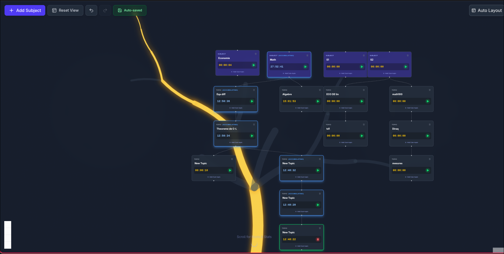
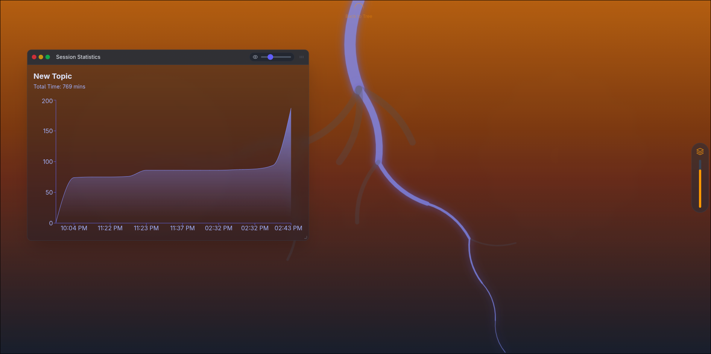

# SessTracker

A visual, tree-based revision tracking application. Organize your subjects, break them down into topics, and track your study time with a hierarchical timer system.





## Features

### Tree View (Top Screen)

- **Hierarchical organization** -- Create root subjects and nested topics, up to 10 levels deep.
- **Auto-layout** -- Organize the tree automatically using the Dagre algorithm.
- **Recursive deletion** -- Deleting a node removes all its descendants.
- **Inline renaming** -- Click on a node label to rename it.
- **Organic background** -- A generative fractal tree grows behind the nodes, with the active study path lighting up in gold.

### Smart Time Tracking

- **Individual timers** -- Each node has its own stopwatch.
- **Recursive accumulation** -- Time spent on a child topic automatically adds up to all its parents.
- **Visual feedback** -- Active node glows green, accumulating ancestors glow blue with an "(Accumulating)" badge.
- **Session history** -- Each start/stop is recorded as a session with timestamps and duration.

### Roots & Statistics View (Bottom Screen)

- **Inverted root tree** -- A mirrored fractal tree grows downward, representing the "roots" of your knowledge.
- **Session statistics** -- An interactive windowed panel (draggable, resizable, adjustable opacity) displays cumulative study time as an area chart.
- **Background opacity control** -- A vertical slider adjusts the warm amber gradient behind the roots.
- **Snap scroll** -- Scroll down from the tree view to reach the roots, or click the navigation hints.

### Undo/Redo

- Full undo/redo support for tree operations (add, delete, rename).
- Keyboard shortcuts: `Ctrl+Z` / `Ctrl+Y`.

### Persistence

- Auto-save to `localStorage` on every state change.
- Server locked to port `5173` to keep `localStorage` consistent across sessions.

## Getting Started

### Prerequisites

- Node.js v18+
- npm

### Installation

```bash
git clone <repo-url>
cd SessTracker
npm install
```

### Development

```bash
npm run dev
```

Open [http://localhost:5173](http://localhost:5173).

### Testing

```bash
npm test
```

## Tech Stack

| Category         | Tool                                  |
| ---------------- | ------------------------------------- |
| Framework        | React 19 + TypeScript 5.9 + Vite 7   |
| Visualization    | React Flow (`@xyflow/react`)          |
| State management | Zustand 5 (with persistence)          |
| Styling          | TailwindCSS v4                        |
| Animations       | Framer Motion                         |
| Charts           | Recharts                              |
| Layout engine    | Dagre                                 |
| Icons            | Lucide React                          |
| Tests            | Vitest + Testing Library              |

## Project Structure

```
├── public/
│   └── vite.svg
├── src/
│   ├── components/
│   │   ├── features/
│   │   │   ├── background/
│   │   │   │   ├── BackgroundTree.tsx   # Upward fractal tree (gold)
│   │   │   │   └── RootsBackground.tsx  # Downward fractal tree (indigo)
│   │   │   ├── controls/
│   │   │   │   └── FloatingControls.tsx # Add Subject, Reset View, Undo, Redo
│   │   │   ├── stats/
│   │   │   │   ├── RootsView.tsx        # Bottom screen: roots + stats window
│   │   │   │   └── StatisticsPanel.tsx  # Recharts area chart
│   │   │   └── tree/
│   │   │       └── MainTree.tsx         # Top screen: ReactFlow + background
│   │   ├── nodes/
│   │   │   └── RevisionNode.tsx         # Custom node: timer, label, controls
│   │   └── ui/
│   │       └── WindowFrame.tsx          # Draggable/resizable window component
│   ├── hooks/
│   │   ├── useAutoLayout.ts             # Dagre-based auto-layout
│   │   └── useTreeCanvas.ts            # Shared Canvas2D fractal tree renderer
│   ├── store/
│   │   ├── slices/
│   │   │   ├── historySlice.ts          # Undo/redo (50 snapshots max)
│   │   │   ├── nodeSlice.ts             # CRUD operations on tree nodes
│   │   │   ├── timerSlice.ts            # Timer toggle, tick, session tracking
│   │   │   └── types.ts                 # Store type definitions
│   │   ├── __tests__/
│   │   │   └── timerSlice.test.ts
│   │   └── useRevisionStore.ts          # Main Zustand store (combines slices)
│   ├── types/
│   │   └── index.ts                     # RevisionNodeData, Session interfaces
│   ├── utils/
│   │   ├── __tests__/
│   │   │   └── graphHelpers.test.ts
│   │   └── graphHelpers.ts              # Tree traversal: ancestors, depth, parent map
│   ├── App.tsx
│   ├── App.css
│   ├── index.css
│   └── main.tsx
├── index.html
├── vite.config.ts                       # Vite config (strict port 5173)
├── vitest.config.ts                     # Vitest config (jsdom)
├── tsconfig.json
├── eslint.config.js
└── package.json
```
